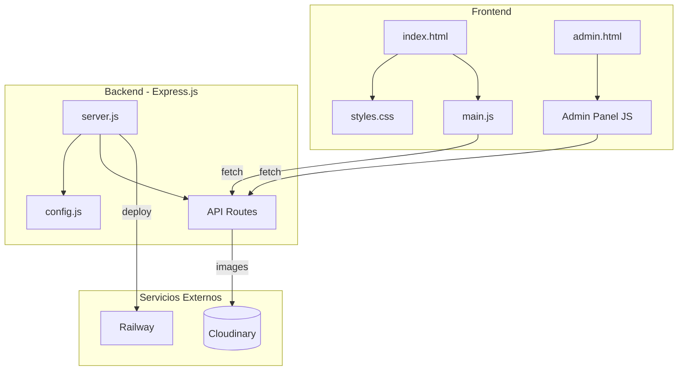
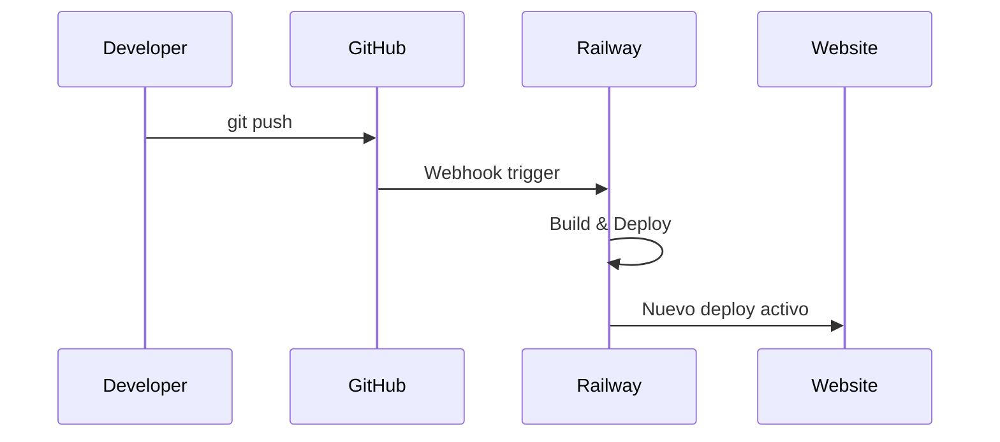

# Cool Energy Abanicos

Sitio web institucional y sistema de gestion para Cool Energy Abanicos - Abanicos premium para festivales y raves, hechos en Uruguay.

## Arquitectura



## Stack Tecnologico

| Componente | Tecnologia |
|------------|------------|
| Frontend | HTML5, CSS3, Vanilla JS |
| Backend | Node.js, Express.js |
| Imagenes | Cloudinary CDN |
| Auth | JWT + bcrypt |
| Deploy | Railway |

## Estructura del Proyecto

```
site/
├── config.js          # Configuracion centralizada
├── server.js          # Servidor Express
├── index.html         # Pagina principal
├── admin.html         # Panel de administracion
├── css/
│   └── styles.css     # Estilos del sitio
├── js/
│   └── main.js        # JavaScript principal
└── images/
    ├── logo.png
    ├── favicon.png
    ├── hero-bg.png
    └── ...
```

## Inicio Rapido

### Requisitos
- Node.js 18+
- Cuenta en Cloudinary
- (Opcional) Cuenta en Railway para deploy

### Instalacion Local

```bash
# Clonar repositorio
git clone https://github.com/ismaeldosil/coolenergy-abanicos-site.git
cd coolenergy-abanicos-site

# Instalar dependencias
npm install

# Configurar variables de entorno
export CLOUDINARY_CLOUD_NAME="tu_cloud_name"
export CLOUDINARY_API_KEY="tu_api_key"
export CLOUDINARY_API_SECRET="tu_api_secret"

# Iniciar servidor
npm start
```

El sitio estara disponible en `http://localhost:3000`

### Panel de Admin

Acceder a `/admin-abanicos-abm` con la contrasena configurada.

## Configuracion

Todas las configuraciones estan centralizadas en `config.js`. Para modificar valores en produccion, usar variables de entorno:

| Variable | Descripcion | Default |
|----------|-------------|---------|
| `SITE_URL` | URL del sitio | `https://web-production-8584.up.railway.app` |
| `PORT` | Puerto del servidor | `3000` |
| `CLOUDINARY_CLOUD_NAME` | Cloud name de Cloudinary | - |
| `CLOUDINARY_API_KEY` | API Key de Cloudinary | - |
| `CLOUDINARY_API_SECRET` | API Secret de Cloudinary | - |
| `JWT_SECRET` | Secreto para tokens JWT | (default inseguro) |
| `ADMIN_PASSWORD_HASH` | Hash bcrypt del password admin | (default) |

## API Endpoints

### Publicos
| Metodo | Endpoint | Descripcion |
|--------|----------|-------------|
| GET | `/api/config` | Configuracion publica del sitio |
| GET | `/api/images` | Lista imagenes de la galeria |
| POST | `/api/analytics/pageview` | Registrar pageview |
| POST | `/api/analytics/event` | Registrar evento |

### Protegidos (requieren JWT)
| Metodo | Endpoint | Descripcion |
|--------|----------|-------------|
| POST | `/api/auth/login` | Autenticacion admin |
| GET | `/api/stats` | Estadisticas de imagenes |
| GET | `/api/analytics` | Datos de analytics |
| POST | `/api/upload/signature` | Firma para upload a Cloudinary |
| DELETE | `/api/images/:id` | Eliminar imagen |

## Deploy en Railway

1. Conectar repositorio de GitHub a Railway
2. Configurar variables de entorno en Railway Dashboard
3. Deploy automatico en cada push a `main`



## Seguridad

- Helmet.js para headers HTTP seguros
- Rate limiting en endpoints API
- Autenticacion JWT con expiracion
- Passwords hasheados con bcrypt
- Validacion de inputs con express-validator
- CORS configurado para Cloudinary

## Licencia

Proyecto privado - Cool Energy Abanicos Uruguay

---

Desarrollado con amor en Uruguay
