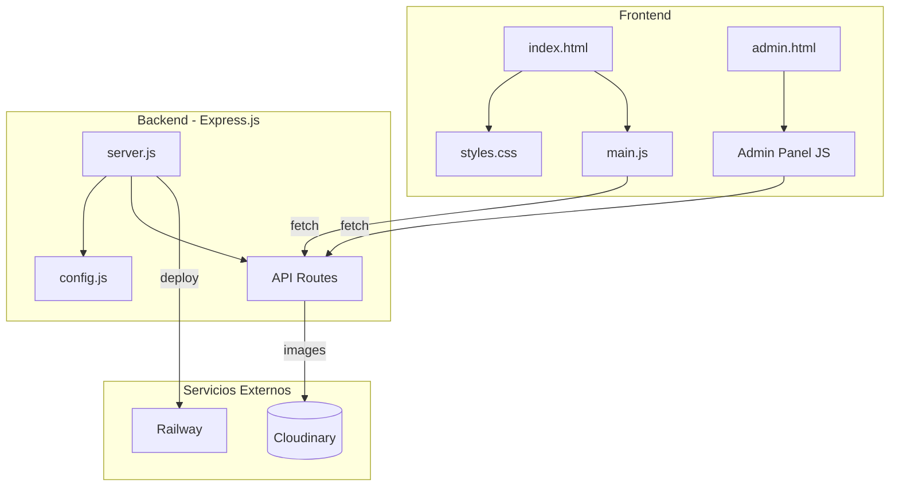
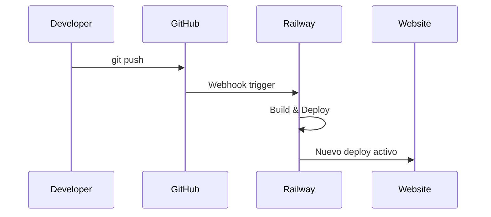

# Cool Energy Abanicos

Sitio web institucional y sistema de gestion para Cool Energy Abanicos - Abanicos premium para festivales y raves, hechos en Uruguay.

## Features

### Sitio Web
- **Galeria Dinamica** - Imagenes cargadas desde Cloudinary CDN con optimizacion automatica
- **Sistema de Fallback** - Si Cloudinary falla, las imagenes se cargan desde GitHub automaticamente ([ver documentacion](docs/FALLBACK.md))
- **Modal de Categorias** - Vista expandida de productos por categoria con animaciones
- **Animaciones CSS** - Efectos de entrada/salida en galeria, hover effects, transiciones fluidas
- **Diseño Responsive** - Optimizado para mobile, tablet y desktop
- **Tema Neon/Rave** - Estetica cyberpunk con gradientes neon y efectos glow
- **SEO Optimizado** - Meta tags, Open Graph, structured data
- **Performance** - Lazy loading, compresion, cache headers optimizados

### Panel de Administracion
- **Autenticacion JWT** - Login seguro con tokens de 24h de expiracion
- **Upload de Imagenes** - Subida directa a Cloudinary con preview y barra de progreso
- **Gestion de Galeria** - Ver, filtrar y eliminar imagenes por categoria
- **Analytics Dashboard** - Visualizacion de pageviews y eventos en tiempo real
- **Estadisticas** - Conteo de imagenes por categoria

### Backend & Seguridad
- **API REST** - Endpoints para imagenes, analytics, autenticacion y configuracion
- **Rate Limiting** - Proteccion contra abuso (100 req/15min API, 5 req/15min auth)
- **Helmet.js** - Headers HTTP seguros
- **bcrypt** - Passwords hasheados con salt
- **express-validator** - Validacion y sanitizacion de inputs
- **Configuracion Centralizada** - Todas las settings en un solo archivo

### DevOps
- **Deploy Automatico** - Push a main = deploy en Railway
- **Health Check** - Endpoint `/health` para monitoreo
- **Variables de Entorno** - Configuracion sin tocar codigo

## Arquitectura



## Stack Tecnologico

| Componente | Tecnologia |
|------------|------------|
| Frontend | HTML5, CSS3, Vanilla JS |
| Backend | Node.js, Express.js |
| Imagenes | Cloudinary CDN |
| Auth | JWT + bcrypt |
| Deploy | Railway |

## Estructura del Proyecto

```
site/
├── config.js              # Configuracion centralizada
├── server.js              # Servidor Express
├── fallback-images.json   # Configuracion de imagenes de respaldo
├── index.html             # Pagina principal
├── admin.html             # Panel de administracion
├── css/
│   └── styles.css         # Estilos del sitio
├── js/
│   └── main.js            # JavaScript principal
├── images/
│   ├── fallback/          # Imagenes de respaldo por categoria
│   │   ├── rave-xl/
│   │   ├── rave-l/
│   │   ├── medium/
│   │   └── personalizados/
│   ├── logo.png
│   ├── favicon.png
│   └── hero-bg.png
└── docs/
    ├── API-Reference.md
    ├── SETUP_TUTORIAL.md
    ├── ADMIN_TUTORIAL.md
    └── FALLBACK.md
```

## Inicio Rapido

### Requisitos
- Node.js 18+
- Cuenta en Cloudinary
- (Opcional) Cuenta en Railway para deploy

### Instalacion Local

```bash
# Clonar repositorio
git clone https://github.com/ismaeldosil/coolenergy-abanicos-site.git
cd coolenergy-abanicos-site

# Instalar dependencias
npm install

# Configurar variables de entorno
export CLOUDINARY_CLOUD_NAME="tu_cloud_name"
export CLOUDINARY_API_KEY="tu_api_key"
export CLOUDINARY_API_SECRET="tu_api_secret"

# Iniciar servidor
npm start
```

El sitio estara disponible en `http://localhost:3000`

### Panel de Admin

Acceder a `/admin-abanicos-abm` con la contrasena configurada.

## Configuracion

Todas las configuraciones estan centralizadas en `config.js`. Para modificar valores en produccion, usar variables de entorno:

| Variable | Descripcion | Default |
|----------|-------------|---------|
| `SITE_URL` | URL del sitio | `https://web-production-8584.up.railway.app` |
| `PORT` | Puerto del servidor | `3000` |
| `CLOUDINARY_CLOUD_NAME` | Cloud name de Cloudinary | - |
| `CLOUDINARY_API_KEY` | API Key de Cloudinary | - |
| `CLOUDINARY_API_SECRET` | API Secret de Cloudinary | - |
| `JWT_SECRET` | Secreto para tokens JWT | (default inseguro) |
| `ADMIN_PASSWORD_HASH` | Hash bcrypt del password admin | (default) |

## Documentacion

| Documento | Descripcion |
|-----------|-------------|
| [API Reference](docs/API-Reference.md) | Documentacion completa de endpoints |
| [Setup Tutorial](docs/SETUP_TUTORIAL.md) | Guia de configuracion de servicios |
| [Admin Tutorial](docs/ADMIN_TUTORIAL.md) | Tutorial del panel de administracion |
| [Fallback System](docs/FALLBACK.md) | Como agregar imagenes de respaldo |
| [Usage Guide](USAGE.md) | Guia de uso general |

## Deploy en Railway

1. Conectar repositorio de GitHub a Railway
2. Configurar variables de entorno en Railway Dashboard
3. Deploy automatico en cada push a `main`



## Seguridad

- Helmet.js para headers HTTP seguros
- Rate limiting en endpoints API
- Autenticacion JWT con expiracion
- Passwords hasheados con bcrypt
- Validacion de inputs con express-validator
- CORS configurado para Cloudinary

## Licencia

Proyecto privado - Cool Energy Abanicos Uruguay

---

Desarrollado con amor en Uruguay
