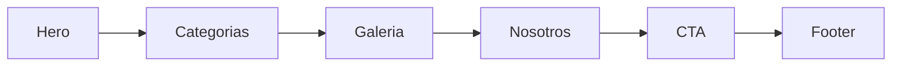
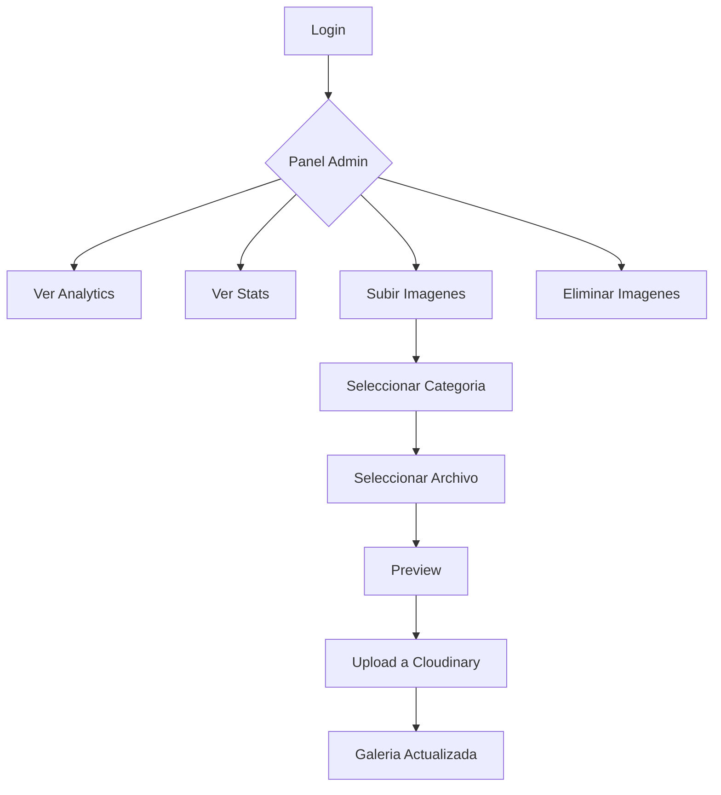
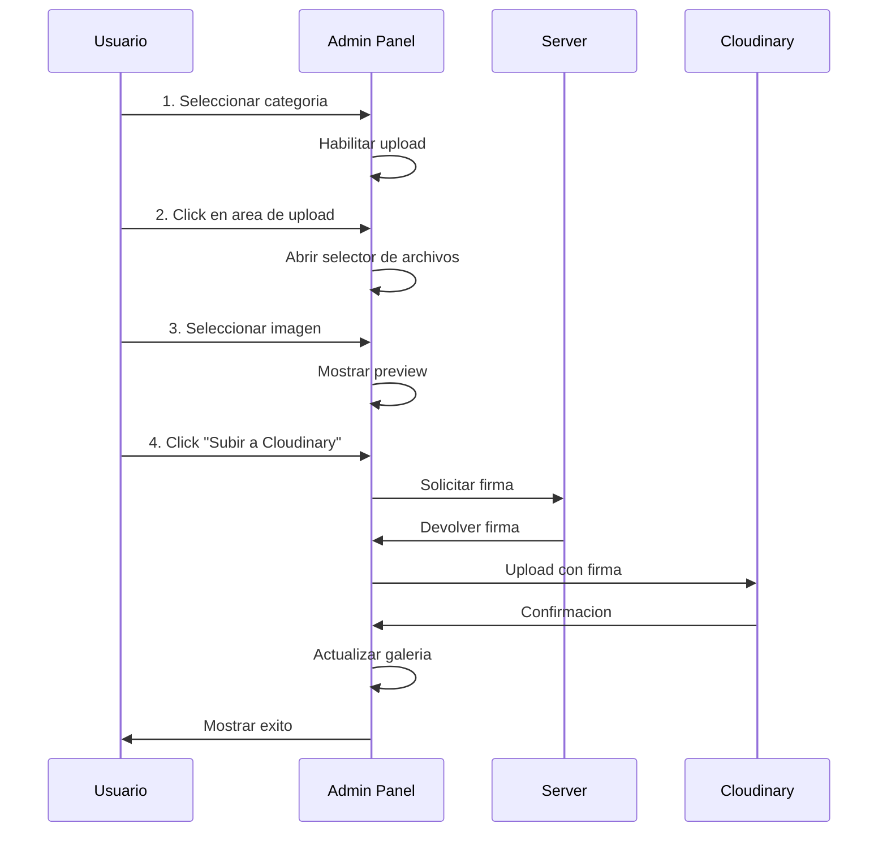

# Guia de Uso - Cool Energy Abanicos

Esta guia explica como usar y mantener el sitio web de Cool Energy Abanicos.

## Tabla de Contenidos

1. [Sitio Web Principal](#sitio-web-principal)
2. [Panel de Administracion](#panel-de-administracion)
3. [Gestion de Imagenes](#gestion-de-imagenes)
4. [Configuracion](#configuracion)
5. [Mantenimiento](#mantenimiento)

---

## Sitio Web Principal

### Estructura de Secciones



### Categorias de Productos

| Categoria | Tamanio | Material |
|-----------|---------|----------|
| RAVE XL | 66cm | Bambu + Nylon |
| RAVE L | 50cm | Bambu + Nylon |
| MEDIUM | 40cm | Madera + Nylon |
| Personalizados | Variable | A pedido |

### Galeria Dinamica

La galeria carga automaticamente las imagenes desde Cloudinary. No requiere modificar codigo para agregar nuevos productos.

---

## Panel de Administracion

### Acceso

1. Navegar a: `https://tu-sitio.com/admin-abanicos-abm`
2. Ingresar contrasena: `#Ab4n1co5-2024!`

### Funcionalidades



### Dashboard

El panel muestra:

- **Analytics**: Visitas del dia y sesiones unicas
- **Stats**: Cantidad de imagenes por categoria
- **Upload**: Formulario para subir nuevas imagenes
- **Galeria**: Vista de todas las imagenes con opcion de eliminar

---

## Gestion de Imagenes

### Subir Nueva Imagen



#### Paso a Paso

1. **Seleccionar Categoria**
   - Click en una de las 4 categorias (RAVE XL, RAVE L, MEDIUM, Personalizados)
   - El area de upload se habilitara

2. **Seleccionar Imagen**
   - Click en el area de upload o arrastrar imagen
   - Formatos permitidos: JPG, PNG, WEBP
   - Tamanio maximo: 10MB

3. **Verificar Preview**
   - La imagen aparecera como preview
   - Puedes quitarla con el boton X si quieres cambiarla

4. **Subir a Cloudinary**
   - Click en "Subir a Cloudinary"
   - Una barra de progreso mostrara el avance
   - Al completar, la galeria se actualiza automaticamente

### Eliminar Imagen

1. En la seccion "Imagenes subidas", encontrar la imagen
2. Pasar el mouse sobre la imagen
3. Click en el boton X rojo
4. Confirmar eliminacion
5. La imagen desaparecera con animacion

### Filtrar Imagenes

Usar el selector "Filtrar por categoria" para ver solo imagenes de una categoria especifica.

---

## Configuracion

### Archivo config.js

Todas las configuraciones estan en `config.js`:

```javascript
module.exports = {
  site: {
    name: 'Cool Energy Abanicos',
    url: process.env.SITE_URL || 'https://...',
    // ...
  },
  server: {
    port: process.env.PORT || 3000,
    adminPath: '/admin-abanicos-abm',
    // ...
  },
  // ...
};
```

### Variables de Entorno

Para cambiar configuraciones en produccion sin modificar codigo:

```bash
# En Railway Dashboard o .env local
SITE_URL=https://mi-nuevo-dominio.com
PORT=3000
CLOUDINARY_CLOUD_NAME=mi_cloud
CLOUDINARY_API_KEY=123456789
CLOUDINARY_API_SECRET=abc123secret
JWT_SECRET=mi-secreto-seguro
ADMIN_PASSWORD_HASH=$2a$10$...
```

### Generar Nuevo Hash de Password

```bash
# Usando Node.js
node -e "require('bcryptjs').hash('mi-nueva-password', 10).then(console.log)"
```

Copiar el hash generado a la variable `ADMIN_PASSWORD_HASH`.

---

## Mantenimiento

### Actualizar el Sitio

```bash
# Hacer cambios locales
git add .
git commit -m "Descripcion del cambio"
git push origin main
```

Railway detectara el push y hara deploy automatico.

### Monitorear

- **Health Check**: `GET /health` devuelve status del servidor
- **Analytics**: Ver en el panel admin
- **Logs**: Disponibles en Railway Dashboard

### Backup de Imagenes

Las imagenes estan en Cloudinary. Para backup:

1. Ir a Cloudinary Dashboard
2. Media Library > coolenergy/abanicos
3. Descargar las imagenes necesarias

### Troubleshooting

| Problema | Solucion |
|----------|----------|
| Imagenes no cargan | Verificar credenciales de Cloudinary |
| Login no funciona | Verificar ADMIN_PASSWORD_HASH |
| 503 en uploads | Cloudinary no configurado |
| Sitio lento | Verificar cache en Railway |

---

## Contacto Tecnico

Para soporte tecnico o desarrollo adicional, contactar al equipo de desarrollo.

---

*Documentacion actualizada: Enero 2026*
