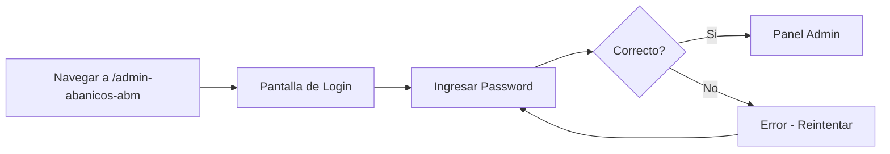
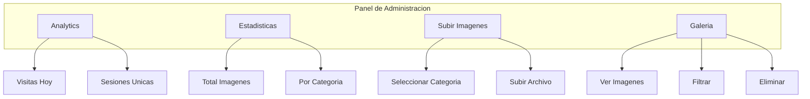
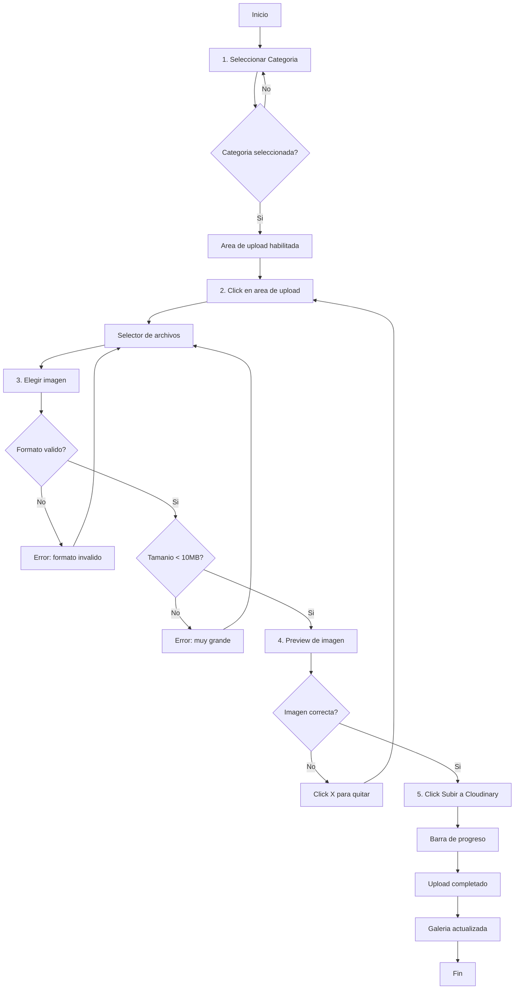
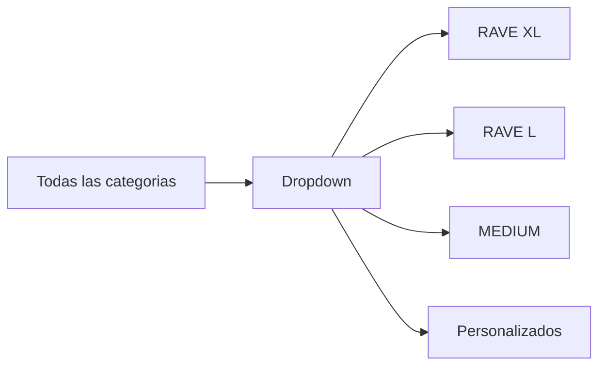
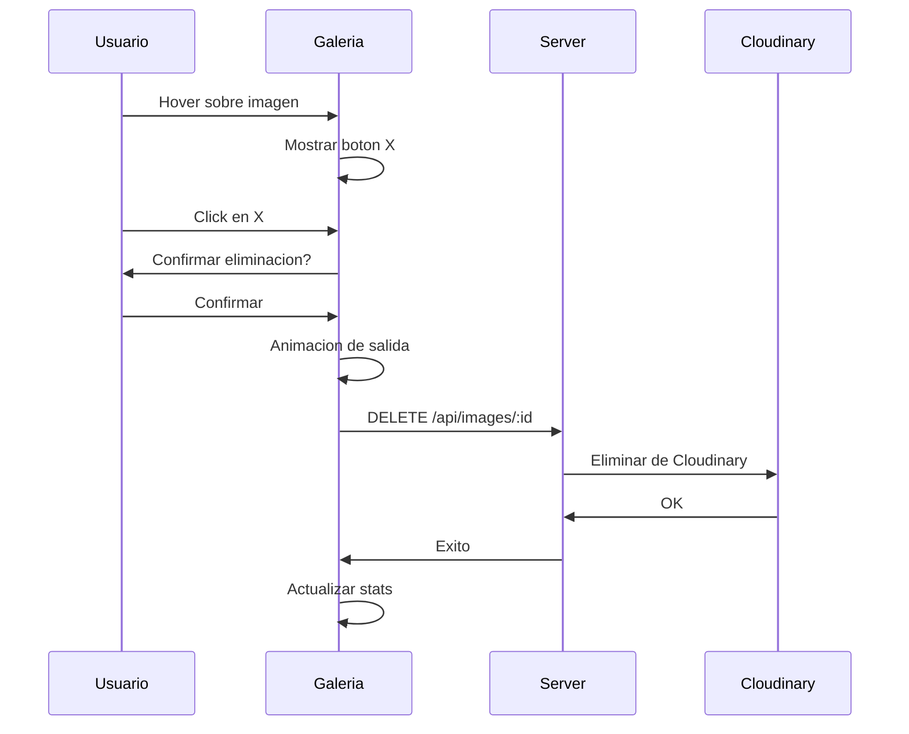
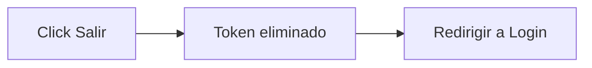
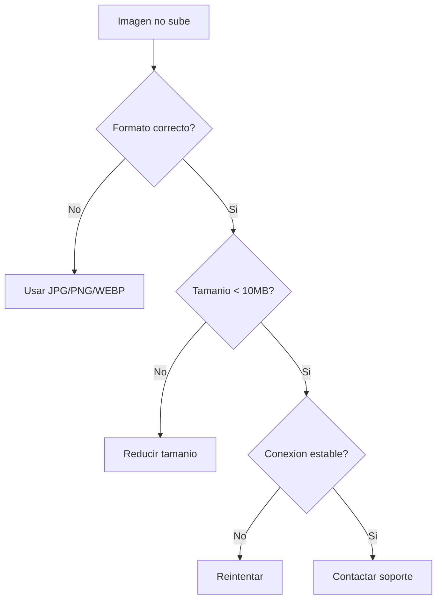
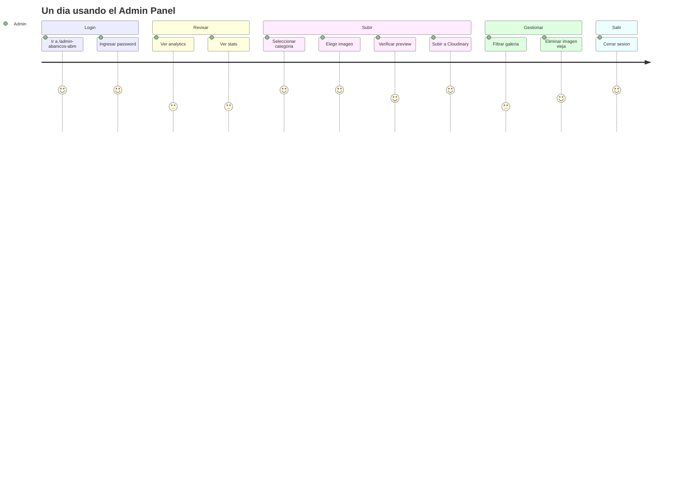

# Tutorial del Panel de Administracion

Guia completa para usar el panel de administracion de Cool Energy Abanicos.

---

## 1. Acceder al Panel

### URL de Acceso

```
https://tu-sitio.com/admin-abanicos-abm
```

### Pantalla de Login



**Password actual:** `#Ab4n1co5-2024!`

> **Nota:** Despues de 5 intentos fallidos, deberas esperar 15 minutos.

---

## 2. Dashboard Principal

Una vez logueado, veras el dashboard con las siguientes secciones:



### Seccion Analytics

Muestra metricas basicas del sitio:

| Metrica | Descripcion |
|---------|-------------|
| Visitas hoy | Total de pageviews del dia |
| Sesiones unicas | Visitantes unicos |

### Seccion Estadisticas

Muestra cantidad de imagenes:

| Stat | Descripcion |
|------|-------------|
| Total | Todas las imagenes |
| RAVE XL | Imagenes en categoria RAVE XL |
| RAVE L | Imagenes en categoria RAVE L |
| MEDIUM | Imagenes en categoria MEDIUM |

---

## 3. Subir Nueva Imagen

### Flujo Completo



### Paso 1: Seleccionar Categoria

```
+------------------+  +------------------+
|    RAVE XL       |  |    RAVE L        |
|    66cm          |  |    50cm          |
+------------------+  +------------------+

+------------------+  +------------------+
|    MEDIUM        |  |  PERSONALIZADOS  |
|    40cm          |  |    A pedido      |
+------------------+  +------------------+
```

- Click en la categoria deseada
- La categoria se resaltara con borde magenta
- El area de upload se habilitara

### Paso 2: Seleccionar Imagen

```
+----------------------------------------+
|                                        |
|     [Icono de Upload]                  |
|                                        |
|   Click para seleccionar imagen        |
|   (RAVE XL)                            |
|                                        |
|   JPG, PNG, WEBP - Max 10MB            |
|                                        |
+----------------------------------------+
```

Opciones:
- **Click** en el area para abrir selector de archivos
- **Arrastrar** imagen directamente al area

### Paso 3: Verificar Preview

```
+----------------------------------------+
|  +-----------------------------+  [X]  |
|  |                             |       |
|  |    [Preview de imagen]     |       |
|  |                             |       |
|  +-----------------------------+       |
|  imagen-seleccionada.jpg               |
+----------------------------------------+
```

- La imagen aparece como preview
- El nombre del archivo se muestra debajo
- Boton X para quitar y seleccionar otra

### Paso 4: Subir a Cloudinary

```
+----------------------------------------+
|  [===========================    ] 75% |
|           Subiendo... 75%              |
+----------------------------------------+
```

- Click en "Subir a Cloudinary"
- La barra de progreso muestra el avance
- Esperar hasta que llegue al 100%

### Paso 5: Confirmacion

```
+----------------------------------------+
|  [check] Imagen subida correctamente!  |
+----------------------------------------+
```

- Mensaje de exito aparece
- La galeria se actualiza automaticamente
- Los stats se actualizan

---

## 4. Gestionar Galeria

### Filtrar por Categoria



Usar el selector para ver solo imagenes de una categoria.

### Eliminar Imagen



**Pasos:**

1. Pasar el mouse sobre la imagen
2. Aparece boton X rojo en la esquina
3. Click en el boton X
4. Confirmar en el dialogo
5. La imagen desaparece con animacion

---

## 5. Cerrar Sesion

Click en el boton "Salir" en la esquina superior derecha.



La sesion expira automaticamente despues de 24 horas.

---

## 6. Tips y Mejores Practicas

### Optimizacion de Imagenes

| Recomendacion | Detalle |
|---------------|---------|
| Formato | Preferir WEBP o JPG |
| Resolucion | 1200x1200 px maximo |
| Tamanio | Menos de 2MB ideal |
| Aspecto | Cuadrado funciona mejor |

### Organizacion

- Subir imagenes a la categoria correcta
- Eliminar imagenes duplicadas
- Mantener galeria actualizada

### Seguridad

- No compartir la contrasena
- Cerrar sesion al terminar
- Usar desde conexion segura

---

## 7. Solucion de Problemas

### Imagen no sube



### No puedo hacer login

1. Verificar que la contrasena es correcta
2. Esperar 15 minutos si hubo muchos intentos
3. Verificar URL correcta (`/admin-abanicos-abm`)

### Galeria no actualiza

1. Refrescar la pagina (F5)
2. Verificar conexion a internet
3. Intentar cerrar y abrir sesion

---

## 8. Resumen Visual



---

*Tutorial creado para Cool Energy Abanicos - Enero 2026*
