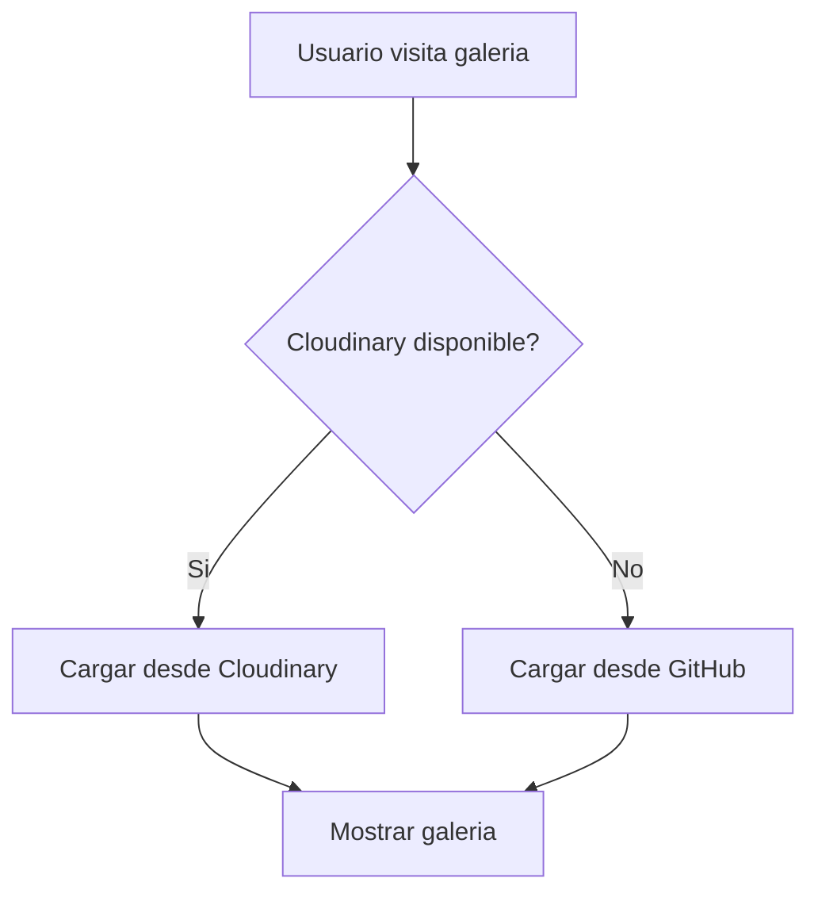

# Sistema de Fallback de Imagenes

Cuando Cloudinary no esta disponible, el sitio carga automaticamente imagenes de respaldo desde GitHub.

---

## Como Funciona



1. El frontend primero intenta cargar imagenes desde `/api/images` (Cloudinary)
2. Si falla o no hay imagenes, intenta `/api/images/fallback`
3. Las imagenes de fallback se sirven desde GitHub raw URLs

---

## Estructura de Carpetas

```
images/
├── fallback/                    # Imagenes de respaldo
│   ├── rave-xl/                 # Abanicos RAVE XL (66cm)
│   │   ├── abanico-001.jpg
│   │   ├── abanico-002.jpg
│   │   └── galaxia-neon.jpg
│   ├── rave-l/                  # Abanicos RAVE L (50cm)
│   │   ├── abanico-001.jpg
│   │   └── ...
│   ├── medium/                  # Abanicos MEDIUM (40cm)
│   │   └── ...
│   └── personalizados/          # Abanicos personalizados
│       └── ...
├── logo.png                     # Assets del sitio
├── hero-bg.png
└── ...
```

---

## Agregar una Imagen de Fallback

### Paso 1: Copiar la imagen

```bash
# Copiar imagen a la categoria correspondiente
cp mi-nuevo-abanico.jpg images/fallback/rave-xl/

# O con un nombre descriptivo
cp foto.jpg images/fallback/rave-l/dragon-azul.jpg
```

### Paso 2: Editar fallback-images.json

Agregar una entrada al array `images`:

```json
{
  "id": "rave-xl-nuevo",
  "filename": "rave-xl/mi-nuevo-abanico.jpg",
  "category": "rave-xl"
}
```

**Campos:**
| Campo | Descripcion | Ejemplo |
|-------|-------------|---------|
| `id` | Identificador unico | `rave-xl-dragon` |
| `filename` | Ruta relativa desde `images/fallback/` | `rave-xl/dragon.jpg` |
| `category` | Categoria del producto | `rave-xl`, `rave-l`, `medium`, `personalizados` |

### Paso 3: Commit y Push

```bash
git add images/fallback/rave-xl/mi-nuevo-abanico.jpg
git add fallback-images.json
git commit -m "Agregar imagen de fallback: mi-nuevo-abanico"
git push
```

---

## Ejemplo Completo

Agregar un abanico con diseño de galaxia a la categoria RAVE XL:

```bash
# 1. Copiar imagen
cp ~/Downloads/abanico-galaxia.jpg images/fallback/rave-xl/galaxia-neon.jpg

# 2. Editar fallback-images.json
# Agregar al array "images":
# {
#   "id": "rave-xl-galaxia",
#   "filename": "rave-xl/galaxia-neon.jpg",
#   "category": "rave-xl"
# }

# 3. Commit y push
git add images/fallback/rave-xl/galaxia-neon.jpg fallback-images.json
git commit -m "Agregar abanico galaxia neon a fallback"
git push
```

---

## Configuracion (fallback-images.json)

```json
{
  "enabled": true,
  "githubRepo": "mogara17/coolenergy-abanicos-site",
  "branch": "main",
  "basePath": "images/fallback",
  "images": [...]
}
```

| Campo | Descripcion |
|-------|-------------|
| `enabled` | `true` para activar fallback, `false` para desactivar |
| `githubRepo` | Repositorio de GitHub (usuario/repo) |
| `branch` | Rama de donde cargar imagenes |
| `basePath` | Carpeta base de las imagenes |
| `images` | Array de imagenes disponibles |

---

## Categorias Validas

| Categoria | Descripcion | Tamaño |
|-----------|-------------|--------|
| `rave-xl` | Abanicos RAVE extra grandes | 66cm |
| `rave-l` | Abanicos RAVE grandes | 50cm |
| `medium` | Abanicos medianos para uso diario | 40cm |
| `personalizados` | Diseños personalizados | XL o L |

---

## Verificar Funcionamiento

### En el navegador

1. Abrir DevTools (F12)
2. Ver Network tab
3. Buscar requests a `/api/images/fallback`

### En consola

```bash
# Verificar que las imagenes estan accesibles
curl https://raw.githubusercontent.com/mogara17/coolenergy-abanicos-site/main/images/fallback/rave-xl/abanico-001.jpg -I
```

### En el sitio

Si Cloudinary no esta configurado, la galeria mostrara automaticamente las imagenes de fallback.

---

## Solucionar Problemas

| Problema | Causa | Solucion |
|----------|-------|----------|
| Imagen no aparece | No esta en el JSON | Agregar entrada a `images` |
| 404 en imagen | Ruta incorrecta | Verificar `filename` y que el archivo existe |
| Galeria vacia | `enabled: false` | Cambiar a `true` en JSON |
| Imagen no carga | Repo privado | El repositorio debe ser publico |

---

## Notas Importantes

- Las imagenes se sirven desde `raw.githubusercontent.com`
- El repositorio debe ser **publico** para que funcione
- Los cambios se reflejan inmediatamente despues del push
- Usar formato **JPG** o **PNG** para mejor compatibilidad
- Tamaño recomendado: menos de 2MB por imagen

---

*Documentacion del sistema de fallback - Cool Energy Abanicos*
