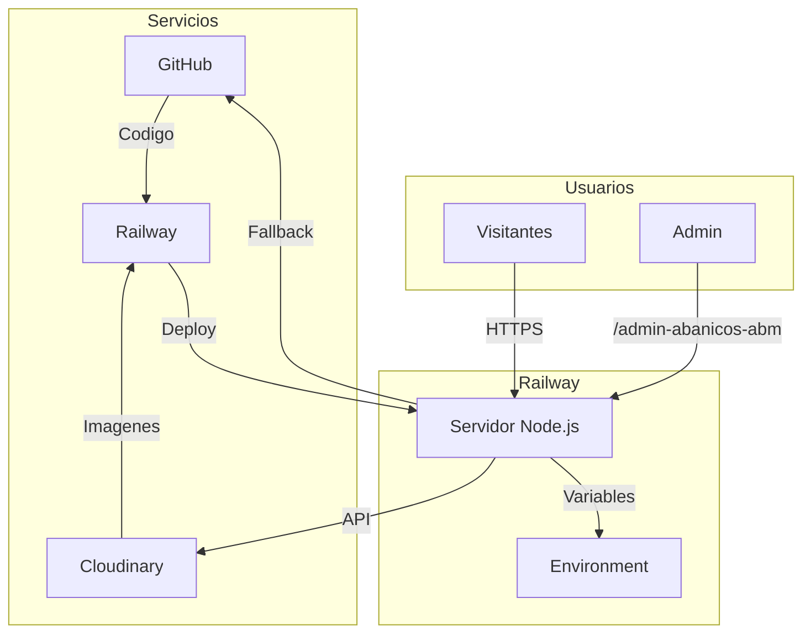
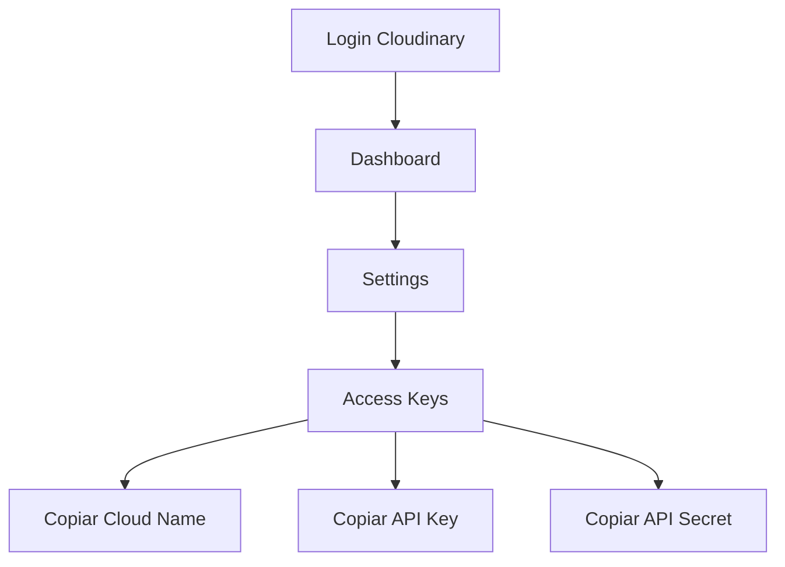
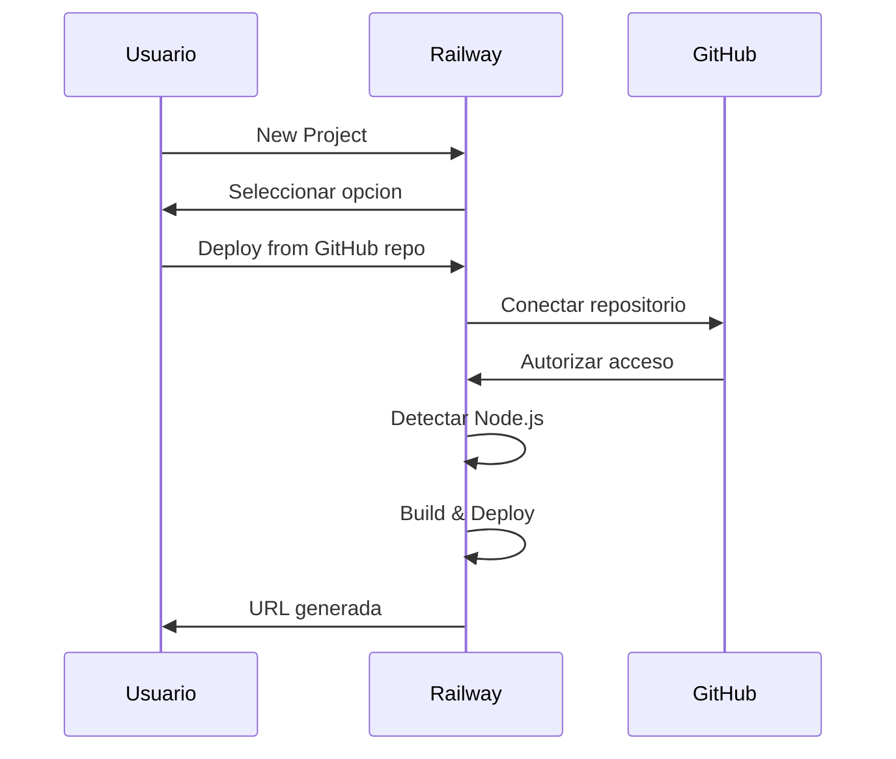
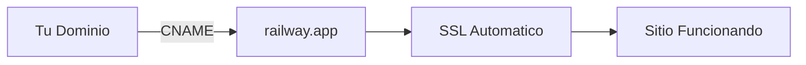
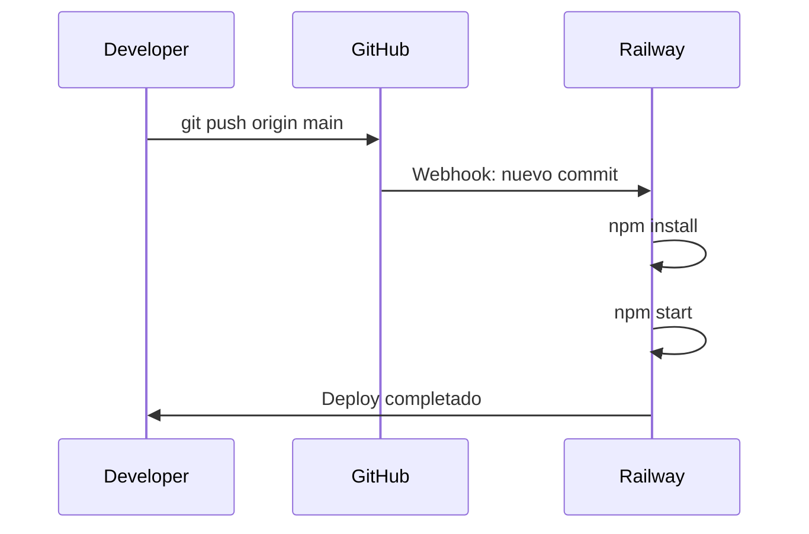
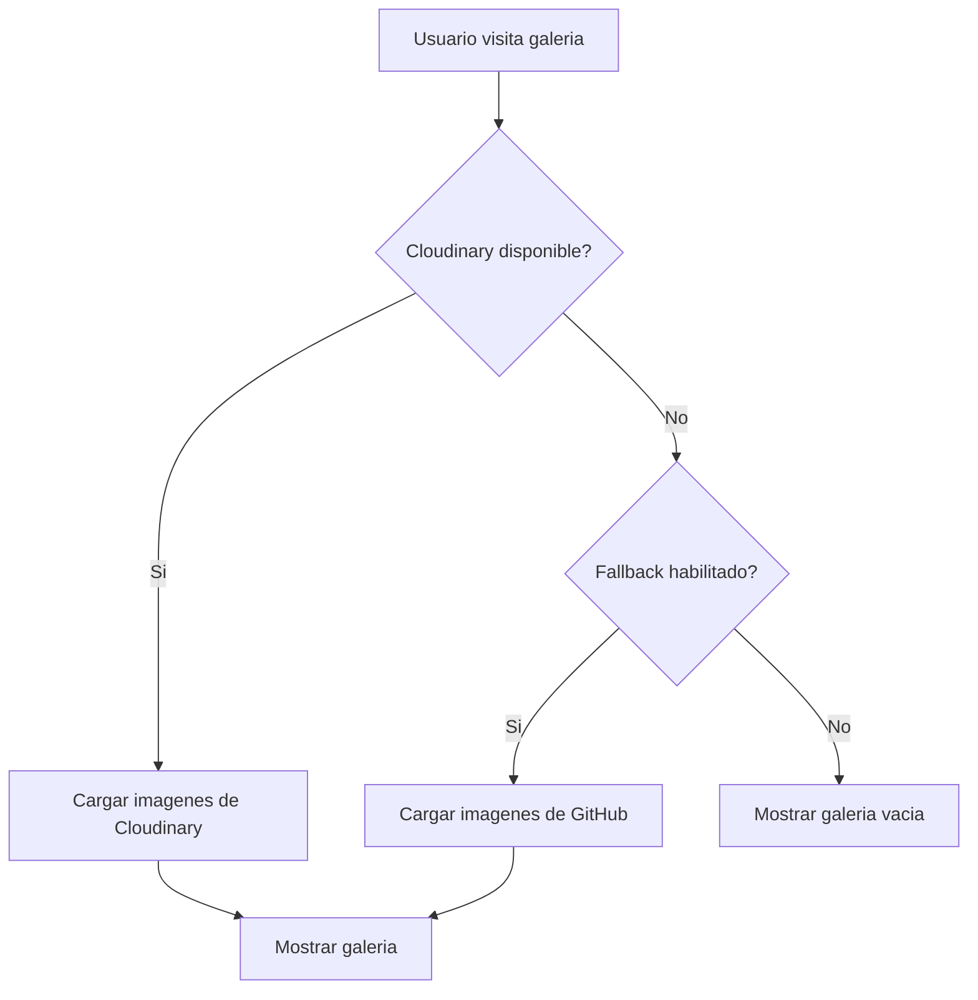
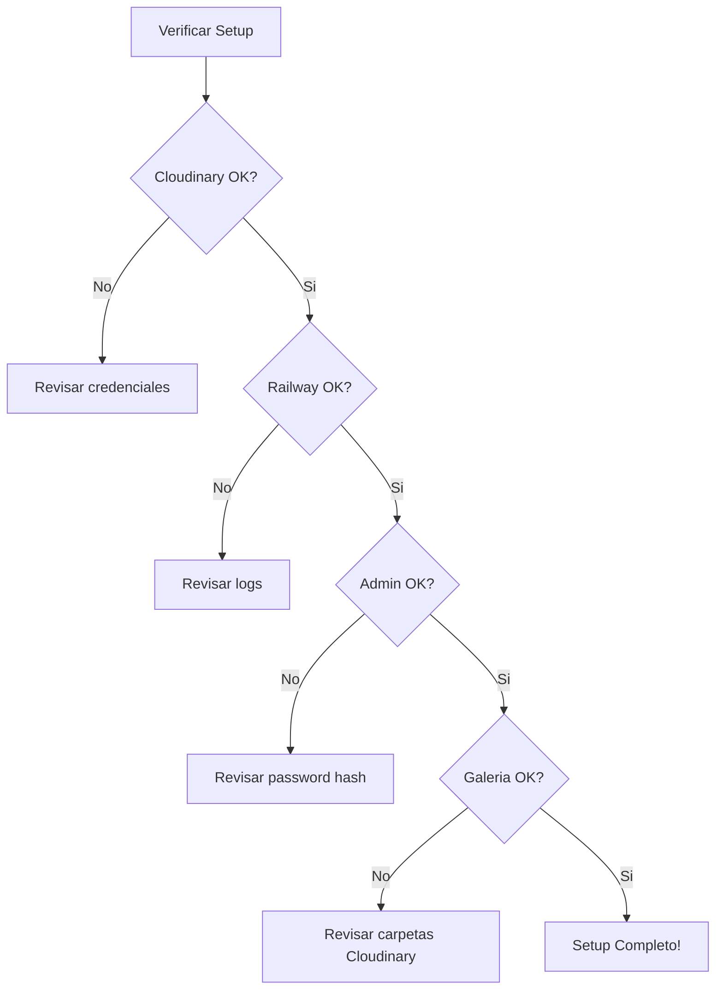

# Tutorial de Configuracion - Cool Energy Abanicos

Guia paso a paso para configurar todos los servicios necesarios para el sitio web.

---

## Tabla de Contenidos

1. [Cloudinary (Imagenes)](#1-cloudinary-imagenes)
2. [Railway (Hosting)](#2-railway-hosting)
3. [GitHub (Repositorio)](#3-github-repositorio)
4. [Variables de Entorno](#4-variables-de-entorno)
5. [Sistema de Fallback](#5-sistema-de-fallback)
6. [Verificacion](#6-verificacion)

---

## Arquitectura General



---

## 1. Cloudinary (Imagenes)

### 1.1 Crear Cuenta

1. Ir a [cloudinary.com](https://cloudinary.com)
2. Click en "Sign Up Free"
3. Completar registro con email

### 1.2 Obtener Credenciales



**Ubicacion en el Dashboard:**

```
Dashboard
├── Settings (engranaje arriba derecha)
│   └── Access Keys
│       ├── Cloud Name: xxxxxxxxx
│       ├── API Key: 123456789012345
│       └── API Secret: xXxXxXxXxXxXxXxXxXxX
```

### 1.3 Crear Estructura de Carpetas

En Cloudinary Media Library, crear:

```
coolenergy/
└── abanicos/
    ├── rave-xl/      (imagenes de 66cm)
    ├── rave-l/       (imagenes de 50cm)
    ├── medium/       (imagenes de 40cm)
    └── personalizados/ (diseños custom)
```

**Paso a paso:**

1. Ir a "Media Library"
2. Click en "Create Folder"
3. Nombre: `coolenergy`
4. Entrar a `coolenergy`
5. Click en "Create Folder"
6. Nombre: `abanicos`
7. Repetir para cada categoria

### 1.4 Configurar Upload Preset (Opcional)

Para subidas mas seguras:

1. Settings > Upload
2. Add upload preset
3. Signing Mode: Signed
4. Folder: coolenergy/abanicos

---

## 2. Railway (Hosting)

### 2.1 Crear Cuenta

1. Ir a [railway.app](https://railway.app)
2. Login con GitHub (recomendado)

### 2.2 Crear Proyecto



**Pasos:**

1. Click "New Project"
2. Seleccionar "Deploy from GitHub repo"
3. Autorizar Railway en GitHub
4. Seleccionar repositorio `coolenergy-abanicos-site`
5. Railway detecta automaticamente Node.js
6. Esperar el primer deploy

### 2.3 Configurar Variables de Entorno

En Railway Dashboard:

1. Seleccionar el proyecto
2. Click en el servicio (servidor)
3. Tab "Variables"
4. Agregar cada variable:

| Variable | Valor |
|----------|-------|
| `CLOUDINARY_CLOUD_NAME` | (tu cloud name) |
| `CLOUDINARY_API_KEY` | (tu api key) |
| `CLOUDINARY_API_SECRET` | (tu api secret) |
| `JWT_SECRET` | (string seguro aleatorio) |
| `ADMIN_PASSWORD_HASH` | (hash bcrypt) |
| `SITE_URL` | https://tu-proyecto.up.railway.app |

### 2.4 Generar Password Hash

Para crear el hash de la contrasena admin:

```bash
# En terminal con Node.js instalado
node -e "require('bcryptjs').hash('TU-PASSWORD-AQUI', 10).then(console.log)"
```

Ejemplo:
```bash
node -e "require('bcryptjs').hash('#Ab4n1co5-2024!', 10).then(console.log)"
# Output: $2a$10$mTqdeAbk0TjKAzH59l.0xeixmYPtj5uVlJBvJDcevwXYRbECtYixy
```

Copiar todo el hash (empieza con `$2a$`) a la variable `ADMIN_PASSWORD_HASH`.

### 2.5 Dominio Custom (Opcional)

1. En Railway, tab "Settings"
2. Seccion "Domains"
3. "Add Custom Domain"
4. Seguir instrucciones DNS



---

## 3. GitHub (Repositorio)

### 3.1 Estructura del Repositorio

```
coolenergy-abanicos-site/
├── config.js           # Configuracion centralizada
├── server.js           # Servidor Express
├── package.json        # Dependencias
├── index.html          # Pagina principal
├── admin.html          # Panel admin
├── fallback-images.json # Imagenes de respaldo
├── css/
│   └── styles.css
├── js/
│   └── main.js
├── images/             # Imagenes estaticas + fallback
└── docs/
    ├── ADMIN_TUTORIAL.md
    └── SETUP_TUTORIAL.md
```

### 3.2 Deploy Automatico

Cada `git push` a `main` dispara deploy automatico:



### 3.3 Branches Recomendadas

```
main        # Produccion (deploy automatico)
develop     # Desarrollo
feature/*   # Nuevas funciones
```

---

## 4. Variables de Entorno

### 4.1 Lista Completa

| Variable | Descripcion | Requerida | Default |
|----------|-------------|-----------|---------|
| `PORT` | Puerto del servidor | No | 3000 |
| `SITE_URL` | URL publica del sitio | No | railway.app URL |
| `CLOUDINARY_CLOUD_NAME` | Nombre cloud Cloudinary | Si | - |
| `CLOUDINARY_API_KEY` | API Key Cloudinary | Si | - |
| `CLOUDINARY_API_SECRET` | API Secret Cloudinary | Si | - |
| `JWT_SECRET` | Secreto para tokens | No | (inseguro) |
| `ADMIN_PASSWORD_HASH` | Hash bcrypt password | No | (default) |

### 4.2 Archivo .env Local (Solo Desarrollo)

Crear archivo `.env` en la raiz (NO commitear):

```env
PORT=3000
SITE_URL=http://localhost:3000
CLOUDINARY_CLOUD_NAME=tu_cloud_name
CLOUDINARY_API_KEY=123456789012345
CLOUDINARY_API_SECRET=xXxXxXxXxXxXxXxX
JWT_SECRET=mi-secreto-super-seguro-local
ADMIN_PASSWORD_HASH=$2a$10$mTqdeAbk0TjKAzH59l.0xeixmYPtj5uVlJBvJDcevwXYRbECtYixy
```

---

## 5. Sistema de Fallback

### 5.1 Como Funciona



### 5.2 Configurar Fallback

Editar `fallback-images.json`:

```json
{
  "enabled": true,
  "githubRepo": "usuario/repositorio",
  "branch": "main",
  "basePath": "images",
  "images": [
    {
      "id": "fallback-001",
      "filename": "imagen.jpg",
      "category": "rave-xl"
    }
  ]
}
```

### 5.3 Agregar Imagenes de Fallback

1. Agregar imagenes a carpeta `/images/`
2. Editar `fallback-images.json`
3. Agregar entrada para cada imagen
4. Commit y push

```bash
# Ejemplo
git add images/nueva-imagen.jpg
git add fallback-images.json
git commit -m "Agregar imagen de fallback"
git push
```

---

## 6. Verificacion

### 6.1 Checklist Post-Setup



### 6.2 Endpoints de Verificacion

| Endpoint | Resultado Esperado |
|----------|-------------------|
| `GET /health` | `{"status":"ok"}` |
| `GET /api/config` | Configuracion del sitio |
| `GET /api/images` | Lista de imagenes |
| `GET /api/images/fallback` | Imagenes de fallback |

### 6.3 Verificar en Terminal

```bash
# Health check
curl https://tu-sitio.railway.app/health

# Verificar imagenes
curl https://tu-sitio.railway.app/api/images

# Verificar fallback
curl https://tu-sitio.railway.app/api/images/fallback
```

### 6.4 Problemas Comunes

| Problema | Causa | Solucion |
|----------|-------|----------|
| Imagenes no cargan | Credenciales incorrectas | Verificar variables Cloudinary |
| 503 en uploads | Cloudinary no configurado | Agregar variables de entorno |
| Login falla | Password hash incorrecto | Regenerar hash bcrypt |
| Deploy falla | Error en package.json | Verificar dependencias |
| Fallback no funciona | JSON invalido | Validar fallback-images.json |

---

## 7. Mantenimiento

### 7.1 Actualizar Password Admin

1. Generar nuevo hash:
   ```bash
   node -e "require('bcryptjs').hash('NUEVO-PASSWORD', 10).then(console.log)"
   ```

2. Actualizar en Railway:
   - Variables > ADMIN_PASSWORD_HASH
   - Pegar nuevo hash
   - Deploy automatico

### 7.2 Backup de Imagenes

1. Ir a Cloudinary > Media Library
2. Seleccionar carpeta coolenergy/abanicos
3. Download Assets

### 7.3 Monitoreo

- **Railway Logs**: Dashboard > Deployments > View Logs
- **Analytics**: Panel admin > Ver estadisticas
- **Health Check**: GET /health cada X minutos

---

## Soporte

Para problemas tecnicos:
- Revisar logs en Railway Dashboard
- Verificar status de Cloudinary
- Consultar documentacion en `/docs`

---

*Tutorial creado para Cool Energy Abanicos - Enero 2026*
